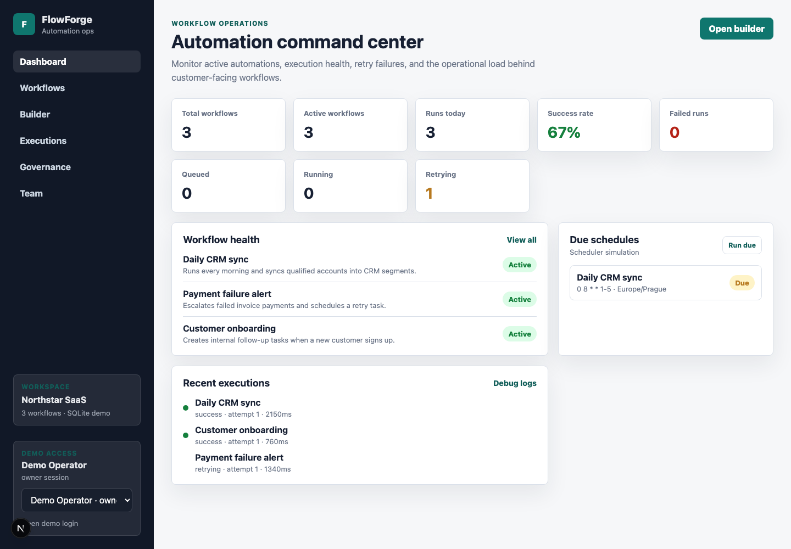
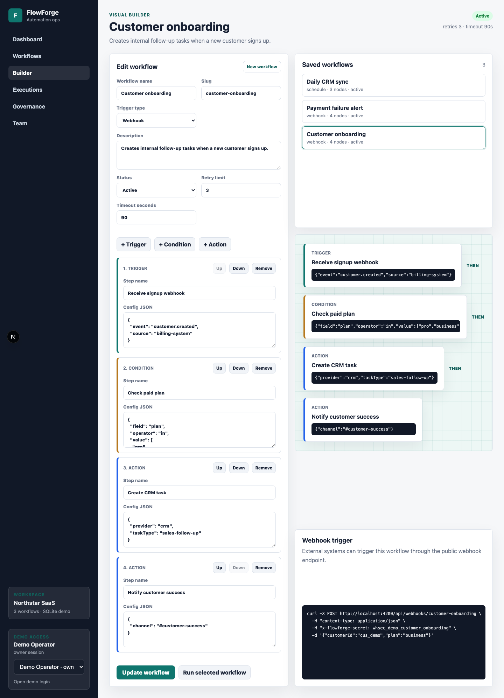

# FlowForge

[](https://github.com/R1washere/flowforge/actions/workflows/ci.yml)

FlowForge is a full-stack workflow automation demo for operations-heavy SaaS
products. It lets a team define workflow triggers, conditions and actions, run
demo executions, inspect execution logs, and simulate webhook or scheduled
automation runs.

This is a personal portfolio project built from scratch. It does not contain
proprietary code, data, internal architecture, or business logic from any
employer.

## Quick Review

- Full-stack monorepo with Next.js UI, NestJS API, Prisma schema and shared
  TypeScript contracts.
- Product area: workflow automation, webhooks, schedules, executions, RBAC,
  integrations and audit events.
- Review path: start with the screenshots, then open
  `docs/reviewer-guide.md`, `docs/architecture.md` and `ROADMAP.md`.
- Verification path: run `pnpm verify` for local checks, builds and smoke
  tests.

## Screenshots





## What I Built

- Workflow dashboard with active, paused, failed and retrying automations.
- Workflow builder for trigger, condition and action steps.
- NestJS execution endpoint that creates step-by-step run logs.
- Secret-protected webhook trigger endpoint.
- Scheduler simulator for due workflows.
- Integration health checks with masked credentials.
- Team and RBAC demo with protected workflow actions.
- Audit trail for workflow changes, execution runs and access changes.
- SQLite seed data for a quick local review.

## Stack

- Next.js
- React
- NestJS
- TypeScript
- Prisma
- SQLite
- pnpm workspaces

## Project Structure

```txt
apps/web          Next.js dashboard and workflow builder
apps/api          NestJS API and execution endpoints
packages/shared   Shared TypeScript contracts
prisma            SQLite schema and seed data
scripts           Local setup, verification and smoke tests
```

## Local Setup

```bash
pnpm install
cp .env.example .env
pnpm db:setup
pnpm dev
```

Web app: `http://localhost:3200`

API: `http://localhost:4200/api`

## Demo Flow

1. Open the dashboard and review workflow health counters.
2. Open the builder and inspect the customer onboarding workflow.
3. Run a workflow execution from the UI or API.
4. Trigger the webhook endpoint with the demo secret.
5. Open integrations, team access and audit events.

Useful API calls:

```bash
curl -X POST http://localhost:4200/api/workflows/customer-onboarding/execute

curl -X POST http://localhost:4200/api/webhooks/customer-onboarding \
  -H "content-type: application/json" \
  -H "x-flowforge-secret: whsec_demo_customer_onboarding" \
  -d '{"customerId":"cus_demo","plan":"business"}'

curl -X POST http://localhost:4200/api/schedules/run-due
```

## Verification

```bash
pnpm verify
```

The verification script resets the local SQLite database, runs checks, builds
the workspaces, starts the local apps, runs smoke tests, and restores seeded
demo data.

## Notes

- Architecture overview: `docs/architecture.md`
- Demo guide: `docs/portfolio-demo-guide.md`
- Reviewer guide: `docs/reviewer-guide.md`
